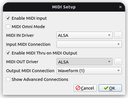

# LinuxでDTM

## オーディオデバイスの使用に関する注意点

### DAWとオーディオAPI

DAWとはdigital **audio** workstationの略であり、DAWを使うにあたってオーディオデバイスへのアクセスはほぼ必須でしょう。

オーディオ制作環境の高度なセットアップについては、WindowsにはWindowsなりの、MacにはMacなりの煩雑さがありますが、カジュアルにDAWを起動して音楽制作したいだけであれば、そのようなセットアップは通常は不要です。しかしLinuxの場合は、使用するDAWの選択にもよりますが、デフォルトで面倒事がついて回ると考えたほうがいいかもしれません。

詳しくは後述しますが、デフォルトで面倒事を回避したい筆者のいつものやり方は「オーディオAPIを選択できるDAWではPulseAudioを選ぶ」「オーディオAPIがPulseAudioでもMIDI入力デバイスが使えるDAWを選ぶ」です。これはリアルタイム性を犠牲にする（状況によっては演奏中に音が飛ぶかもしれない）選択肢ですが、それさえ許容できれば問題ありません。この節の残りの長い説明も読み飛ばして大丈夫かもしれません。

オーディオをリアルタイムで（音が途切れたりしないように）処理するために、WindowsではASIOというドライバーのサポート技術がありますが、これは他のオーディオデバイスの利用を制限することになります。LinuxではJackというオーディオアクセス機構がASIOに近いものです。Linuxの汎用的なオーディオアクセスAPIはALSA (Advanced Linux Sound Architecture) と呼ばれ、JackはALSAデバイスを占有してリアルタイム性を保証します。Jackはそれ自体はオーディオデバイスへのアクセスを自ら実装する存在ではなく、オーディオデバイスやMIDIデバイスへの読み書きをリアルタイムで処理するためのAPIです。

このJackが環境によっては割と曲者で、他のアプリケーションがオーディオデバイスを利用しているときはそれらを止めてしまったり、逆にJackの初期化に失敗してそれ以上DAWが起動してくれない、といった問題が起こったりします。たとえばWebブラウザが起動していてオーディオデバイスが使われていたりすると、Jackが使えません。Jackを正常に起動できるようにするには、`/etc/security/limits.conf`などLinuxのシステム設定を正しく調整する必要もあります。JackにはJack1とJack2があり、互換性がありません。通常はJack2を使うことになると考えられますが、Jack1のパッケージが依存関係で引き込まれそうになることもまれにあります（注意して回避すれば大丈夫です）。

それらのことが理解できていても、筆者の場合は、jackを制御するツールqjackctlなどで手動で起動しようとしても期待通りに起動してくれないようなUbuntuデスクトップ環境を何度も経験してきました。

そもそも音楽の打ち込みの際には他のアプリケーションでオーディオファイルを再生したりする場面が頻繁にあるはずで、オーディオデバイスを複数セットアップしているのでなければ、Jackを使わないほうが作業環境としては妥当でしょう。オーディオアクセスを排他的に行いたいのであれば、Jackを正しく理解して使う必要があるでしょう。

ちなみに、ALSAを使用する場合でも、DAWでデバイスに排他的にアクセスするような使い方をしていれば、仮にデバイスを占有できたとしても、作業中に遭遇する問題はJackと大きく変わりません。

ALSAとJack以外の選択肢としては、ネットワークオーディオなどもサポートするPulseAudioが有り得ます。古いLinux用DAWにはPulseAudioのようにリアルタイム性を放棄した「プロフェッショナルではない」作業環境に対するリスペクトが無くPulseAudioをサポートしなかったものもありますが、現在ではArdourも含めPulseAudioがサポートされているのが一般的といってよいでしょう。それでもPulseAudioデフォルトのオーディオ設定にはなっていないことが多いので、その場合は手動で設定を変更する必要があります。また、ArdourではJack以外の選択肢ではMIDIデバイスが利用できなかったりしますし、QTractorのように現在でもJackが必須になっているものもあります。

オーディオアクセスAPIのトレンドは、今後PulseAudioからPipeWireに切り替わっていくことも考えられますが、2022年の本書執筆時点ではまだPipeWireをサポートするDAWは見当たりません。まず各Linuxディストリビューションで標準装備されるべきだとはいえるでしょう。

### MIDI: ALSA rawmidiとALSA sequencer

MIDIデバイスの利用もさまざまな困難がつきまといます。

いったんDAWから考えを切り離して、MIDIデバイス単体での利用可否を論じますが、LinuxではUSB-MIDIデバイスの接続はほぼ問題なく行えるでしょう。筆者の環境にはあまりUSB-MIDIデバイスが存在しませんが、USB-MIDIデバイスの接続で問題になった経験はありません。USBとは、USBドライバーさえあれば個別のデバイスドライバーが無くてもそのデバイスをUniversalに利用できるようにするための規格であるはずです。

一般的にLinuxのMIDI接続はALSAであり、APIとしてはALSA sequencerがサポートされていてUSB-MIDIだけでなく仮想MIDIデバイスなども利用できるというのが一般的です。仮想MIDIデバイスというのはつまりソフトウェアで仮想的に作り出すMIDIデバイスのことです。MacOSやLinuxではこれが自由にできます。Windowsではできません。Windows用ソフトloopMIDIのような仮想MIDIデバイスドライバーをインストールする必要もありません。LinuxデスクトップにはVMPKという仮想ピアノアプリがあって、PC上のキーボードからMIDI演奏が可能です。

デフォルトではFluidsynthを利用してアプリケーション単体で音を出しますが、ALSA仮想MIDIデバイスとして使えるように設定することも可能です。（ALSAデバイス名が”out"というわかりにくい名前になるので、利用時には気に留めておきましょう。）

ALSAの仮想MIDIデバイスを作るのは（プログラマー視点では）比較的簡単で、筆者もKotlin言語で自作したMIDIキーボードアプリで実現しています。

ところで、一般的にDAWではALSA sequencerがサポートされていると書きましたが、この例外がalsa-rawmidiしかサポートしていないOracle Javaのjavax.sound.midiのAPIを使っているソフトウェアで、具体的にはBitwig Studioです。alsa-rawmidiでは仮想MIDIがサポートされていないので、VMPKのようなソフトウェアがMIDIデバイスとして認識されないことになります。

BLE MIDIデバイスのサポートの状況は厳し目です。LinuxでBLEをサポートするのはBluezというソフトウェアスタックで、BLE MIDIのサポートも実装されているのですが、Ubuntuなどでは（なぜか）デフォルトで無効になっています。有効になっているかどうかは、`ldd /usr/sbin/bluetoothd`などを実行して、`libasound.so.*`が含まれているかどうかで判断できます。無効になっているBLE MIDIを有効にするには、bluezをソースから「BLE MIDIを有効にして」ビルドしてインストールする必要があります（やや高度な作業になるので諦めたほうが良いかもしれません）。

なお、Linuxアプリケーションが動作するChromeOSでは、USB-MIDIデバイスが認識されないレベルで使えません。その割にWeb MIDI APIでは認識されたりするのですが、これはChromeOSがUSBデバイスへのアクセスをストレージなど限定された種類に限定しているためです。2021年時点でこの問題を改善する意思がないので（chromium issue #1050136）、今後も少なくとも数年間は期待できなそうです。

### Jack MIDI: MIDIアクセスに影響するオーディオAPIの選択

さて、MIDIデバイスが単独で利用可能かどうかは、オーディオAPIの選択とは無関係であるべきですが、残念ながら現実のLinux用DAWでは密接に関連しています。

典型的な問題パターンは「MIDIデバイス接続サポートの実装がJack経由でしか実装されていない」、すなわちMIDIサポートがJackのMIDIアクセスAPI（プログラマー向けに説明するなら`jack/midiport.h`）を使用して実装されている場合です。伝統的にJack経由でのオーディオアクセスしか実装してこなかったDAWでは一般的な実装だったとも考えられます。その場合、DAWでオーディオAPIでJackを選択できるようになった後も、「MIDIデバイスを使いたいならJackを使え」という状態になっているわけです。

オーディオAPIの選択がALSAであればMIDIデバイスアクセスの部分にはALSA sequencer APIを使って実装すべきところです。DAWによってはオーディオAPIとMIDI APIを別々に選択できるようにもなっていたりするので、「何を選択したら何が利用可能になるのか」が整理される必要がありますし、これは開発者だけでなくユーザーのレベルでも混乱の原因となります（これがLinuxのDAWを不必要に難しくしているといえます）。

類似の問題として、「JackとALSAはサポートしているがPulseAudioではMIDIデバイスが選択できない」というケースもあります（Ardour6）。

筆者の私見としては、「DTMはノートPC1台だけでできるべき」であり、そのためには「複数のオーディオデバイスが無くてもできるべき」であり、かつ「DAWで打ち込み作業をしながらWebブラウザやオーディオファイルプレイヤーで音を出せるべき」なので、「Jackで排他的にデバイスを利用せずにDAWを操作できるべき」と考えています。おそらくそのように考えるDTMerは少なくないのではないでしょうか。この考えだと通常利用できないDAWがいくつか出てきますが（Ardour、QTractorなど）、これは仕方ないと考えています。

最後に、JackやJack MIDIに関する筆者のお気に入りの参考情報を（英語ですが）いくつかWeb検索して探せる範囲で列挙します。

- "ALSA and JACK MIDI explained (by a dummy for dummies)" - Jack MIDIとは何なのかを説明してくれています
- "How do I configure my linux system to allow JACK to use realtime scheduling?" - Jackがリアルタイムスケジューリングに失敗する原因と対処方法がいくつかまとめられています

