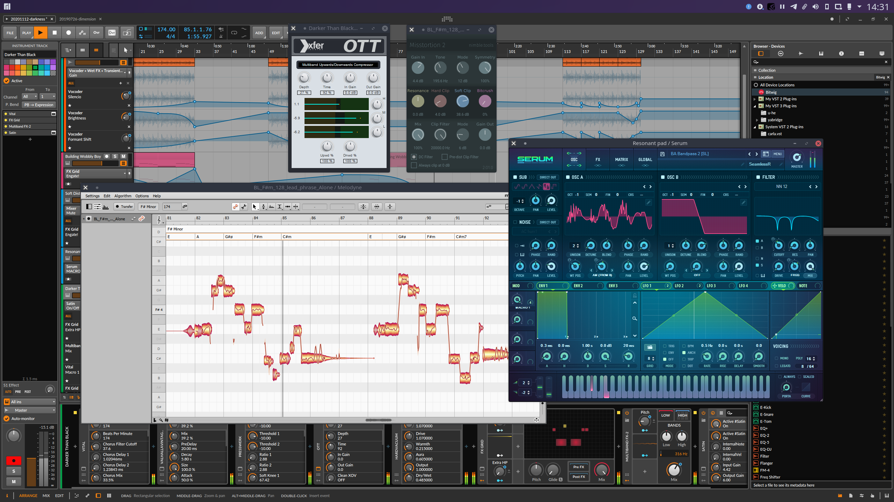
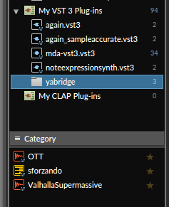

# LinuxでDTM

## 一般的な注意点

### DAWとオーディオAPI

オーディオ制作環境の高度なセットアップについては、WindowsにはWindowsなりの、MacにはMacなりの煩雑さがありますが、Linuxの場合はデフォルトで面倒事がついて回ると考えたほうがいいかもしれません。リアルタイムで音が途切れたりしないように処理するために、WindowsではASIOというドライバーのサポート技術がありますが、これは他のオーディオデバイスの利用を制限することになります。

LinuxではJackというオーディオアクセス機構がASIOに近いものです。Linuxの汎用的なオーディオアクセスAPIはALSAと呼ばれ、JackはALSAデバイスを占有してリアルタイム性を保証します。このJackが環境によっては割と曲者で、他のアプリケーションがオーディオデバイスを利用しているときはそれらを止めてしまったり、逆にjackの初期化に失敗してそれ以上DAWが起動してくれない、といった問題が起こったりします。筆者の場合は、jackをqjackctlなどで手動で起動しようとしても期待通りに起動してくれないようなUbuntuデスクトップ環境を何度も経験してきました。jackにはjack1とjack2があり、互換性がありません。通常はjack2を使うことになると考えられますが、jack1のパッケージが依存関係で引き込まれそうになることもまれにあります（注意して回避すれば大丈夫です）。そもそも音楽の打ち込みの際には他のアプリケーションでオーディオファイルを再生したりする場面が頻繁にあるはずで、オーディオデバイスを複数セットアップしているのでもなければ、jackを使わないほうが作業環境としては妥当かもしれません。

jack以外の選択肢としてはPulseAudioが有り得ます。古いLinux用DAWはそのような作業環境に対するリスペクトが無くPulseAudioをサポートしなかったものもありますが、現在ではArdourも含めPulseAudioがサポートされているのが一般的といってよいでしょう。それでもPulseAudioデフォルトのオーディオ設定にはなっていないことが多いので、その場合は手動で設定を変更する必要があります。

### MIDI接続の問題

LinuxではUSB-MIDIデバイスの接続はほぼ問題なく行えるでしょう。筆者の環境にはあまりUSB-MIDIデバイスが存在しませんが、USB-MIDIデバイスの接続で問題になった経験はありません。

一般的にDAWがサポートするLinuxのMIDI接続はALSAであり、APIとしてはALSA sequencerがサポートされていてUSB-MIDIだけでなく仮想MIDIデバイスなども利用できるというのが一般的です。仮想MIDIデバイスというのはつまりソフトウェアで仮想的に作り出すMIDIデバイスのことです。MacOSやLinuxではこれが自由にできます。Windowsではできません。Windows用ソフトloopMIDIのような仮想MIDIデバイスドライバーをインストールする必要もありません。LinuxデスクトップにはVMPKという仮想ピアノアプリがあって、PC上のキーボードからMIDI演奏が可能です。

デフォルトではFluidsynthを利用してアプリケーション単体で音を出しますが、ALSA仮想MIDIデバイスとして使えるように設定することも可能です。

ところで、一般的にDAWではALSA sequencerｔがサポートされていると書きましたが、この例外がalsa-rawmidiしかサポートしていないOracle Java上でjavax.sound.midiのAPIを使っているソフトウェアで、具体的にはBitwig Studioです。alsa-rawmidiでは仮想MIDIがサポートされていないので、VMPKのようなソフトウェアがMIDIデバイスとして認識されないことになります。

BLE MIDIデバイスについては状況はより厳し目です。LinuxでBLEをサポートするのはBluezというソフトウェアスタックで、BLE MIDIのサポートも実装されているのですが、Ubuntuなどではデフォルトで無効になっています。有効になっているかどうかは、`ldd /usr/sbin/bluetoothd`などを実行して、`libasound.so.*`が含まれているかどうかで判断できます。無効になっているBLE MIDIを有効にするには、bluezをソースからBLE MIDIを有効にしてビルドしてインストールする必要があります（やや高度な作業になるので諦めたほうが良いかもしれません）。

なお、Linuxアプリケーションが動作するChromeOSでは、USB-MIDIデバイスが認識されないレベルで使えません。その割にWeb MIDI APIでは認識されたりするのですが、これはChromeOSがUSBデバイスへのアクセスをストレージなど限定された種類に限定しているためです。2021年時点でこの問題を改善する意思がないので（chromium issue #1050136）、今後も少なくとも数年間は期待できなそうです。

## 音楽ソフトの入手方法

### パッケージからインストールする

TODO

### Windows用のオーディオプラグインを使用する

現実的な問題として、Linux用オーディオプラグインのラインアップは、Windows用のそれには遠く及びません。一方で、Windows用ソフトウェアは、Wineを使うと動かせるものが少なくありません。STEAMでは、Windows版のゲームをWineでそのまま動かせるとしていくつかのパッケージが販売されています。オーディオプラグインの場合は特にVST2/VST3のAPIが実装されていればよく、プラグイン本体にWineでも実装されていないような機能を実装する場面は少なく、特に基本的に.NETなどを使わずC++で作られているはずで、Wineとの相性はだいぶ良いはずです。

オーディオプラグインの実装テクニックのひとつとして、自身をオーディオプラグインとしてそのプラグインフォーマットのAPIを実装しつつ、その中では他のプラグインをホストして呼び出す、いわゆるプラグインラッパーあるいはブリッジと呼ばれる手法があります。オーディオプラグインとして、Wineの機能を使ってWindowsのプラグインをブリッジするソフトウェアが、Linuxデスクトップでは古くから開発されてきました。

これらはWineが成熟する以前からさまざまな開発者によって作られてきたもので、2022年の本書執筆時点ではrobbert-vdh/yabridgeがお薦めです。少し古い情報であれば、Airwave、LinVSTといったツールが紹介されていると思います。MelodyneやSerum、OTTが動作している様子が見られます。筆者はLinuxネイティブプラグインを使うので、yabridgeを使ったことはほとんどありませんが、OTT、Varhalla Supermassive、Plogueなどは動作確認しています。

yabridgeの基本的な使い方を少しだけ説明します。うまく行かない場合はGitHubプロジェクトの`README.md`を参照してください。

- Wineを使用して、Windows用のオーディオプラグインをインストールします。インストーラーが無い場合は、一般的には`~/.wine/drive_c/Program Files/Common Files/VST2`（VST2の場合）や `~/.wine/drive_c/Program Files/Common Files/VST3`（VST3の場合）にファイルをコピーします（VST3の場合は`*.vst3`の形式のディレクトリ名になるはずです）。
- yabridgeのバイナリパッケージは公式GitHubリポジトリのReleaseページ、あるいはOpen(SUSE) Build Service (OBS)上にあります。`*.tar.gz`アーカイブの場合は、ダウンロードして内容を `~/.local/share/` ディレクトリ以下に展開します。`~/./local/share/yabridge`というディレクトリができるはずです。このディレクトリの中に`yabridgectl`というツールがあるので、これを次に使います。OBSパッケージの場合は、このツールがPATHの通った場所にインストールされていることでしょう。
- `yabridgectl`を使って、Wine上のVST2/VST3のパスを追加します。例: `~/.local/share/yabridge/yabridgectl add ~/.wine/drive_c/Program Files/Common\ Files/VST3`（VST3の場合）
- yabridgeの`sync`コマンドを実行すると、Linux環境上の`~/.vst`や`~/.vst3`にyabridgeのプラグインが追加されます: `./local/share/yabridge/yabridgectl sync`

これでDAWを開いて、プラグインリストを最新の状態に更新してみると、yabridgeがVSTプラグインとしてリストアップされるでしょう。全てのWine上のプラグインが1つのyabridgeというプラグインコンテナーに含まれた状態として認識されるはずです。

### オープンソースのプラグインをソースコードからビルドする

序文にも書きましたが、本書で紹介するソフトウェアには、バイナリパッケージが用意されていないものがあります。それらを使うためには、読者各位のPC上でソースコードからビルドしてインストールする必要があります。これはプログラマーでない読者にとっては難しく見える作業でしょうが、一般的なプログラマーにとっても（慣れた作業に聞こえるとしても）本書で紹介するソフトは特殊で、一般的な経験は通用しません。「./configure; make; sudo make install でいける」ものは多くありません。逆に、「インストール」する作業も、特にオーディオプラグインの場合は単にホームディレクトリ以下の所定のディレクトリにコピーするだけのことが多く、比較的安全に「システムを壊す」心配なく済ませることができます。

日本ではソフトウェアのビルドはプログラマーの仕事とみなされることが多いと思いますが、筆者の周辺にはたまに「プログラミングはできないがオープンソースのツールをインストールして使うくらいはできる」という職業ソフトウェアユーザーが（日本人でも）少なからずいます。そもそもプログラミングに類する作業もプログラマー以外の従業員が着手していたりします。義務教育でプログラミングが普及すれば、このような傾向はさらに拡大するでしょう。

ソースコードからのビルドとインストールは、「コマンドラインで指定されたコマンド／実行すべきコマンドを必要な時に実行するだけ」であって、プログラミングの知識が無くても何とかなります。出自不明で自分でもよくわからないコマンドの実行（特に得体の知れないサイトに載っているようなもの）には警戒すべきですが、読者にとって筆者が何者であるかが明らかで、いつでも公開の場で糾弾できる本書に、危険なコマンドを掲載するのは筆者にとってはデメリットだらけで、読者が恐れる理由はほぼ無いと思います。とはいえ、筆者が無知／無頓着で危険なスクリプトを提示する可能性は常に警戒したほうが良いでしょう。心配な場合は周囲の詳しい知人などに質問しつつ、不必要に恐れることなく実行することをお勧めします。

## ソースからビルドする場合の手順

オーディオプラグインのソースには特殊なものもありますが、一般的なビルドシステムを使っているものもあります。プロジェクトによってはひとつのビルドスクリプトの中で複数のビルドシステムを部分的に利用していることもあります。一方で複数のビルドシステムをサポートしているだけ（どれを使っても良い）ということもあります。正確なことは、それぞれのプロジェクトのREADMEなどのドキュメントを見てください。

もっとも、オーディオプラグインのソースによっては、READMEが不親切な場合も少なからずあります。典型的なパターンとしては「これはJUCEのプロジェクトなんだからJUCEアプリのビルド方法なんて説明しない」という感じのものです。「WindowsのVisual Studio用のソリューションファイル`*.sln`がリポジトリに入っていれば、それをVisual Studioで開くだけ」「MacのXcode用の`*.xcodeproj`が入っていればXcodeで開くだけ」なのが自明であるのと同様です。とはいえ、これは知識がないと分からない話なので、この節ではJUCEを含む、典型的なビルドスクリプトファイルとビルド方法について、説明しておこうと思います。

### オーディオプラグイン以外でも使われるビルドシステム

次のリストは「一般的なほう」のビルドシステムです。

- **CMake**: ソースツリー（ディレクトリツリー）に`CMakeLists.txt`というファイルがあれば、そのプロジェクトではCMakeというビルドシステムが使われています。この場合、典型的なビルド手順は、（cmakeをシステムにインストールした上で）`cmake -Bbuild -GNinja`からの`cmake --build build`となります。CMakeはソースツリーに影響を及ぼさずにビルドディレクトリ（この手順例の場合は`build`）以下にビルド中間ファイルとビルド結果を全て生成します。`sudo cmake --install build`などもサポートされているかもしれませんが、VST2やVST3の場合は、ビルド結果を`~/.vst`や`~/.vst3`にコピーするだけのほうが安全です。ビルドディレクトリの中から`find build -name *.vst3`などを実行して、コピーすべきファイル／ディレクトリを探してください。CMakeは数多くのプラグインの開発に使われているJUCEの比較的新しいバージョンであるJUCE6以降でもサポートされており、`CMakeLists.txt`があればJUCEのプロジェクトのものである可能性がそこそこ高いです。
- **Make**: ソースツリーに`Makefile`というファイルがあれば、そのプロジェクトは`make`でビルドするものである可能性が高いです。Linuxで特にLV2をサポートするプラグインの場合は、`DISTRHO/DPF`というオーディオプラグインフレームワークが使われていることが少なからずあります。ビルド結果がどこに作られるかはプロジェクト次第ですが（CMakeのように洗練されたビルド出力ディレクトリは存在しないでしょう）、`find . -name *.vst3`などで探せるでしょう。
- **meson**: ソースツリーに`meson.build`というファイルがあれば、そのプロジェクトではMesonという比較的新しいビルドシステムが使われています。この場合の典型的なビルド手順は、ninjaとmesonをシステムにインストールするか、mesonのソースツリーをチェックアウトして、`meson setup build`からの`ninja -C build`を実行することとなるでしょう（mesonソースツリーから実行する場合はトップディレクトリの`meson.py`を`meson`の代わりに実行します）。
- **autotools**: ソースツリーに`configure`や`autogen.sh`といったファイルが含まれていれば、それはGNU Autotoolsをビルドシステムとして使用している可能性が高いです。典型的なビルドは`./configure; make; sudo make install`のようになるでしょうが、Autotoolsの使い方はLinuxの一般的な話になるので、これ以上は割愛します。

### JUCE: Projucer

JUCEはかつてProjucerという独自のビルドシステムのみをサポートしていました。もしソースツリーに`*.jucer`というファイルがあれば、それはProjucer用のプロジェクトファイルです。ProjucerはCMakeやmesonと同様、それ自体はビルドツールではなく、プラットフォームに合わせてVisual StudioのプロジェクトやXcodeのプロジェクト、Linux用にはMakefileを生成したりするものです。JUCEのProjucerはGUIツールでもあり、これでロードすることもできます。

GUIでビルドファイルを生成するというのは、必ずしも作業体験が良いわけではなく、特にビルドの自動化とは相容れません。Projucerは`--resave`という引数を指定すると、コマンドラインだけで`.jucer`から各種プロジェクトファイルをエクスポートできます。

Projucerからビルドファイルをエクスポートすると、Linuxの場合は（デフォルトでは）`Builds/LinuxMakefile`というディレクトリが作られ、その中に`Makefile`が生成されます。`make -C Builds/LinuxMakefile`でこのMakefileに記述されたビルドを実行できます。ビルド結果は`Builds/LinuxMakefile/builds/`以下に作られるので、その中から（VST3の場合は）`*.vst3`などのディレクトリを`~/.vst3`以下にコピーすれば使えるようになります。

Linuxサポートに関しては、Projucerのプロジェクトにはひとつ問題があります。開発者がLinux環境の存在を意識していない場合、LinuxのMakefileをエクスポートする設定が含まれていない可能性があります。その場合、`.jucer`ファイルを編集してLinux用ビルド設定を追加する必要があります。

また、ProjucerはJUCEのバージョンにも密接に結びついているところがあり、生成されたプロジェクトファイルが古いままでJUCE本体をアップデートしたりすると、ビルドに失敗します。JUCEを使用したプラグインはJUCEをgit submoduleで指定していることも多く、そのJUCEのソースツリーに含まれているProjucerを使用してビルドするほうが確実です。

なお、JUCEでLinux環境でのVST3がサポートされるようになったのはJUCE6以降のみなので注意が必要です。もしVST3版を使いたいプラグインでJUCE5.4.7以前のバージョンが使われていたら、まずJUCE6にアップグレードしてみるとよいでしょう。ただしこれはプログラムの修正が必要になるかもしれないので、難しそうなら諦めてWindows版のVST3をyabridgeで使うのも手です。

### waf

wafはPythonで作られたビルドシステムのひとつですが、LV2本家がwafを使っていることもあってか、LV2プラグインのビルドによく使われています。近年ではCMakeやmesonなどwaf以外のビルドシステムも使われているようです。

wafが使われている場合は、`waf`というスクリプトファイルが含まれている場合がほとんどで、別途ビルドツールをダウンロードする必要は通常はありません。たまにLV2の作者が作った`autowaf`というwafの補助ライブラリがgitのsubmoduleで参照されていることがあるので、（autowafを使っている）LV2プラグインのソースをgitリポジトリからチェックアウトした場合は、`git submodule update --init recursive`を忘れずに実行しましょう。

