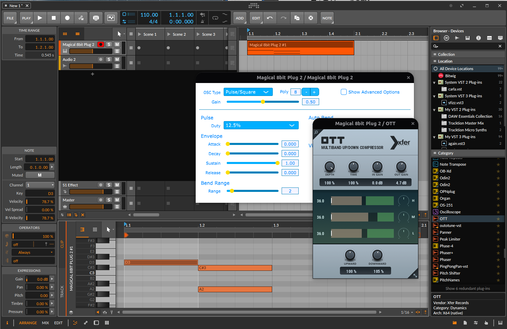
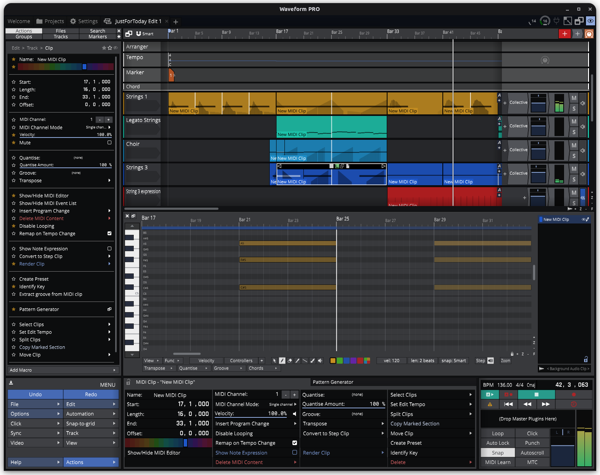
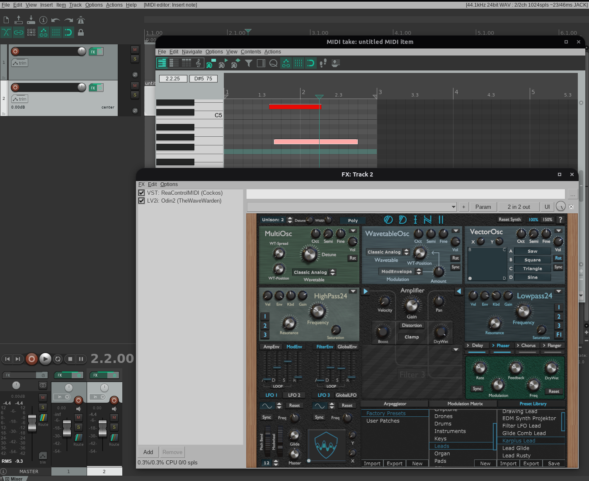
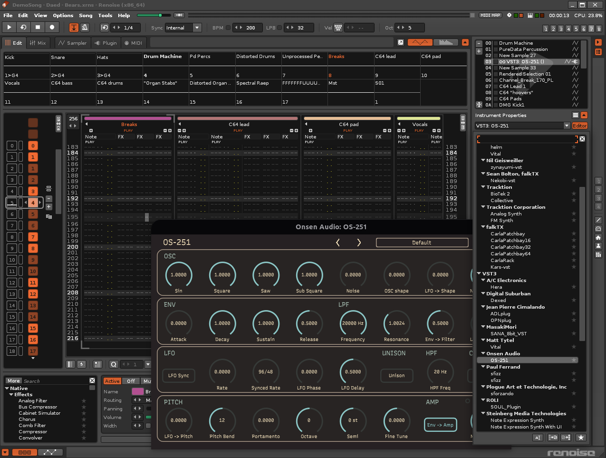
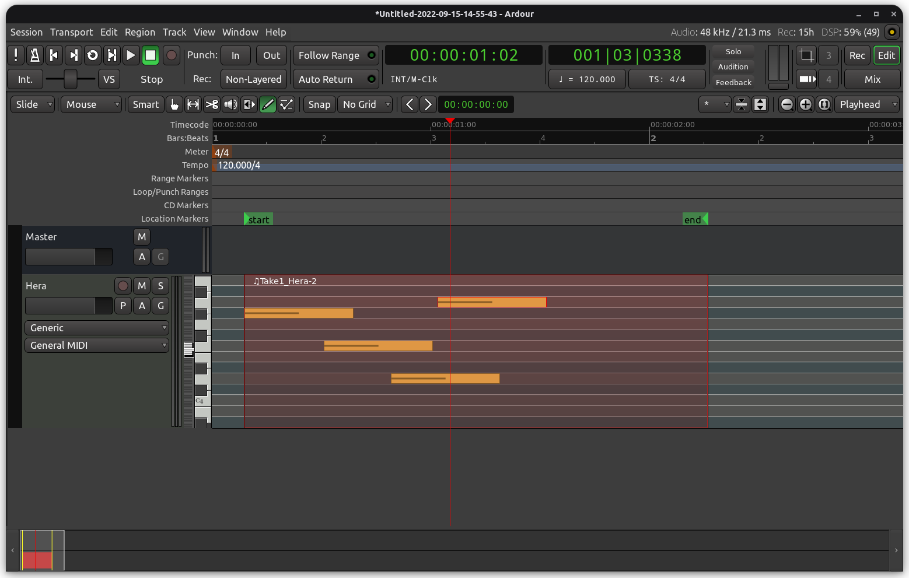
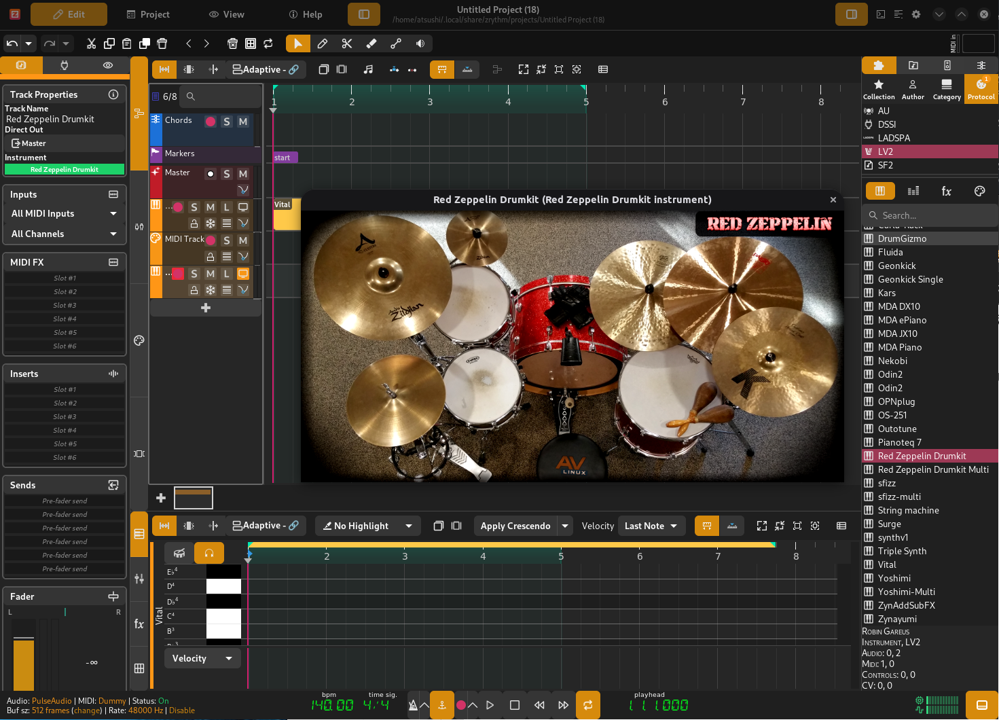
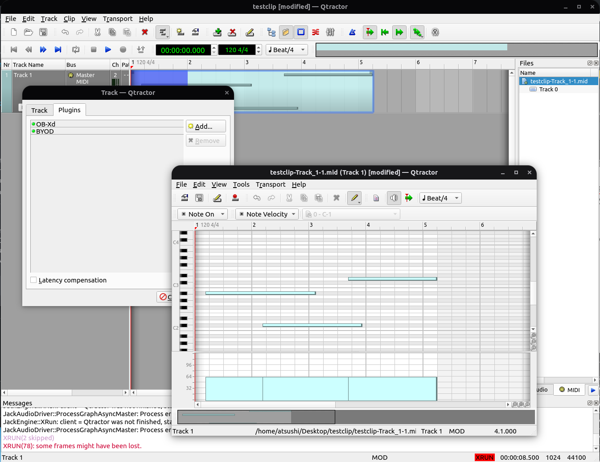
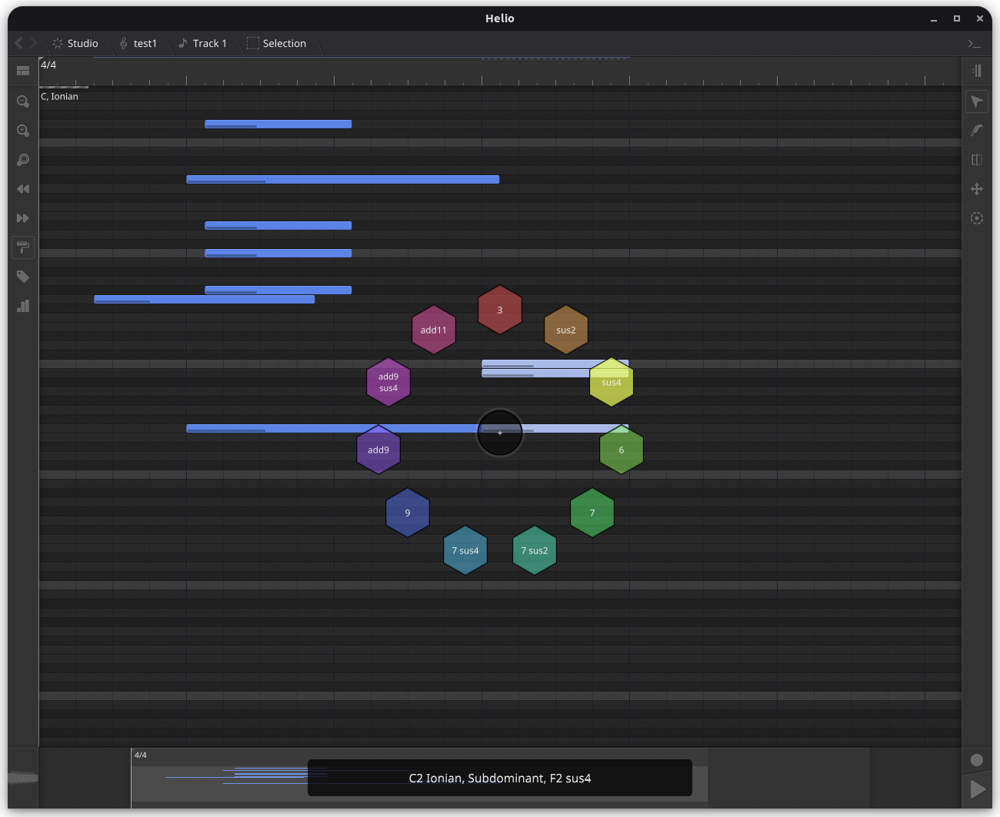

# Linuxで使えるDAW

この章ではLinuxで使えるDAWを商用製品・オープンソースともに紹介していきます。商用DAWはWindows版・Mac版があるもの（そしてそれらが主要なプラットフォームであること）がほとんどです。オープンソースDAWはLinux版がメインのものが多いですが、やはり他のプラットフォームでも動作するものがほとんどです。いずれの場合も、利用できるプラグインの顔ぶれが（まだまだ）だいぶ異なるはずなので、ユーザー体験もそれなりに違うと想定しておいたほうがよいかもしれません。

本書では各DAWの使い方全般を説明することはありません（それぞれ1冊の独立した本が書けるレベルになってしまうでしょう）。「このソフトが／こんなソフトがLinuxでも使えるんだ」という情報を広めるのが本書の主な目的です。この章の残りの部分は、各DAWの簡単な説明とスクリーンショットの掲載が中心となります。

//embed[latex]{
\clearpage
//}

## Bitwig Studio

ドイツにあるBitwig社のBitwig Studioは、2009年にAbleton社の従業員らが独立して作り上げたDAWで、本書で取り上げるDAWの中では比較的一般層向けの直感的なGUI構成をもち、その実Javaで作られている（ただしGUIはOpenGL系の独自ライブラリを使っている）DAWです。2022年にはCLAPプラグインの開発を後押しする主要な企業としても知られるようになっています。

第1章でも言及しましたが、BitwigがALSA仮想MIDIデバイスを認識できない数少ないDAWのひとつです。MIDI入力として仮想MIDIデバイスを使用できません。さらに、JackがALSA MIDIをサポートするように設定されているとBitwig Studioから使えなくなるという罠があるようです。これはjavax.sound.midiによるMIDIアクセスがALSA経由でしか行えず、JackがMIDIデバイスを占有するとALSAから見えなくなってしまうためだと筆者は推測します。

Bitwig StudioのLinux版には実のところさまざまな落とし穴があり、KVR Forumでは "Bitwig on Linux -- How to avoid common issues" というスレッドに情報がいろいろまとまっています。

//embed[latex]{
\clearpage
//}

## Waveform Free/Pro

Tracktion社のWaveformは、もともとは本書で何度も登場しているJUCEを使用して作られたDAWであり、JUCEの開発者も元々はTracktionのために開発していた側面があります。そのため、JUCEの最新バージョンの適用も比較的早く、オーディオプラグイン技術の最新機能も取り込まれやすくなっています。その上、DAWの根幹となる、演奏と編集を担う機能の非GUI部分が tracktion_engine というオープンソースプロジェクトでGitHubに公開されており、誰でもこのDAWと同じ編集機能をもつDAWを独自に構築でき、あるいはWaveformで打ち込んだ楽曲を独自のツールで再生できます。

Waveformはクローズドソースの有償製品で、かつては古いバージョンをフリー版としていたのですが、Waveform 11か12の頃から最新版Waveformの機能制限版をフリー版として配布するようになったので、Waveform11以降でサポートしているLinux用VST3もフリー版で使えます。

Waveformは、オーディオドライバーの選択がPulseAudioでも問題なくMIDIデバイスに接続できる希少なDAWのひとつで、筆者はこれを常用しています。

//embed[latex]{
\clearpage
//}

## Reaper

Reaperはかなりギーク寄りの、プログラミング指向の強いユーザーが好んで使う傾向のあるDAWです。一方で、筆者が複数のDTMユーザーアンケート情報のサイトを参照した限り、この章で説明するDAWの中では、なんと日本人には一番使われているらしいDAWでもあります。最も人気があるとしても難解なDAWであることに変わりはないので、とっつきやすいものを好む読者には向いていないかもしれません。そういう読者は、もっと機能が少なくてシンプルなDAWを使うとよいでしょう。

ReaperもオーディオAPIをALSA/JACK/PulseAudioから選択できますが、Reaper for Linuxでは仮想MIDIデバイスすなわちALSA rawmidiに出現しないALSA sequencerデバイスを接続できないようです。USB-MIDIデバイスはどのオーディオAPIを選択していても利用できます。

//embed[latex]{
\clearpage
//}

## Renoise

Renoiseは他のDAWとは毛色が大きく異なります。音楽制作ツールのカテゴリーとしてはトラッカーということになり、ピアノロールエディタの類は含まれていません。サンプラーとしての利用が中心となると思われますが、オーディオプラグインの類もロードできます。Linux環境ではVST2とVST3、あと古いですがLADSPAやDSSIがサポートされています。

RenoiseではALSAとJACKからのみオーディオAPIを選択できますが、筆者が非リアルタイム環境で試した限りではALSAデバイスへのアクセスは非排他的で、またその状態でALSA  sequencerデバイスも正しく認識されるので、ストレスの無いオーディオ作業のワークフローが確保できるでしょう。

//embed[latex]{
\clearpage
//}

## Ardour / MixBus

ArdourはLinux音楽フリーソフトウェア界隈で最もポピュラーと思われる伝統的なDAWで、今でもアクティブに開発が進められています。ArdourはGPLv2で公開されており、ArdourをHarrison製品に合わせてカスタマイズして販売されているのがMixBusです。低レベルオーディオサポートでは幅広いAPIをカバーしていて、たとえばJackのバックエンドにALSAではなくOSSやNetJackなどさまざまなドライバーを利用できます。一方でPulseAudioを使っているとやはりMIDIデバイスを利用できません。筆者はqjackctlで事前に立ち上げていたJackサーバ、およびALSAで利用したときに、MIDIデバイスを接続できました。ALSAの場合もALSA sequencerに対応しているので、仮想MIDIデバイスも利用可能です。

GUIの作り方がとにかく特殊で、特にピアノロールエディターは一般的なDAWユーザーには最初のノート1つ打ち込むまでの操作方法が全くわからないまま使うのを諦めるかもしれません。筆者はトラックリストがピアノロールエディタを包含していてトラックの高さを買えないと全く表示されないということに気づくまでかなり時間がかかりました。MIDI入力をトラックに結びつけるUIもかなり特殊です。

//embed[latex]{
\clearpage
//}

## Zrythm

Zrythmは新進気鋭のフリーソフトウェアDAWです。バイナリパッケージは有償販売されていますが、ソースコードはAGPLで公開されています。実装技術としては、Carlaというプラグインホストのエンジン部分を利用して作られています。Carlaがサポートするものは全てサポートされていて、LV2、VST、VST3、LADSPA、DSSIのほか、CarlaがFluidsynthを組み込んでいるSF2サウンドフォントやSFZeroを組み込んでいるSFZサンプラーなどもカバーされています。

Zrythmはまだバージョン1.0に向けて開発が進んでいる状態で、2022年の本書執筆時点では、JackとPulseAudioが選択できるものの、ALSAサポートが "not working" とされている状態です。MIDIデバイスのサポートもJack MIDIのみ実装されています。

//embed[latex]{
\clearpage
//}

## QTractor

QTractorはQtで作られたDAWです。機能的にはシンプルなUIでMIDI 1.0の範囲だけ作られているようにも見えますが、プラグインパラメーターのオートメーションも実装されていますし、CLAPプラグインのサポートなど先進的な機能にも取り組んだりしています。オーディオAPIサポートはJack一択です。

//embed[latex]{
\clearpage
//}

## helio-workstation

helio-workstationは、ここまで紹介してきたものとはまただいぶ毛色の違うUIをもつDAWです。作者は「現代のDAWは複雑過ぎる」として新しく直感的な設計を志向して作っているようです。helioはdistraction freeであるとも主張していて、いわゆるzen modeの雰囲気があります。helioはJUCEアプリケーションであり、オーディオレイヤーではALSA、Jack、PulseAudioを、MIDI接続が壊れる心配なく利用できます。サポートするオーディオプラグインフォーマットは、バイナリパッケージではVST2とVST3ですが、ソースからビルドすればLV2も簡単に追加できるでしょう。

