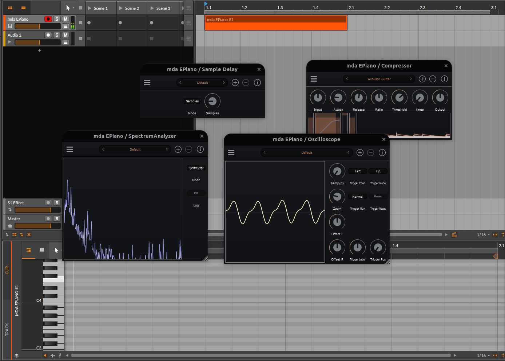

# Linuxで使えるオーディオプラグイン

この章ではLinuxで利用可能なオーディオプラグインを紹介していきます。2022年現在、Linuxでも利用可能なオーディオプラグインもだいぶ増えてきて、「知っているもの」「動作するもの」をあるだけ紹介するようなフェーズではないので、「クロスプラットフォームで利用できるもの」「WindowsやMacで使うものとあまり変わらないもの」「シンプルで使いやすいもの」を中心に紹介していきます。筆者はDTMのプロフェッショナルではないので、豊富な経験に基づく推薦ができるほどの知見がありません。

本書ではプラグインを「サンプラー」「シンセサイザー」「エフェクト」に大分類して紹介します。ギタープラグイン、ピアノプラグイン、ドラムプラグイン…のような紹介にはなりません。これら生楽器の類は基本的にサンプラーで音源を探してください。リズムトラックの入力を補助できるプラグインのようなものも考えられますが、筆者が知るものには無いため、今回紹介するリストには含まれていません。

## サンプラー

サンプラーはさまざまな音源から録音されたPCMデータに対して、音量や音程を自由に加工して楽器として利用するものです。サンプラーの技術は20世紀からありますが、PC上で特定のシンセや処理系に依存しない汎用データとして利用できる可能性を示したのはサウンドフォントが起源であると考えてよいでしょう。

サウンドフォントは、SoundBlasterというPC用の音源基盤を販売していたCreative Technology社が、PCM音源を活用してMIDIメッセージ入力をもとにあたかもMIDI楽器であるかのようにオーディオデータを生成する仕組みであり、またその仕組みのために使われるPCMデータをバンドルしたファイルのフォーマットでもあります。

もともとはSoundBlasterというサウンドボード上で処理することを前提に作られたものでしたが、PCの性能が向上してソフトウェアのみでも十分に合成できるようになって、Creative Technology社とは無関係にTimidityやFluidsynthといったソフトウェアが誕生しました。

サンプラーには、そのソフトウェアで使用される**プロプラエタリなフォーマット**を使うものと、**オープンなデータフォーマット**を使用するものがあります。また、独自フォーマットであってもポピュラーなものはさまざまな楽器サンプラーデータの作成者が有償・無償でデータを公開しています。オープンなデータフォーマットではSF2やSFZがポピュラーです。クローズドなフォーマットとしてはNative Instruments社のKontakt（NKI）も広く使われています。

この章ではサンプラーに限らずさまざまなプラグインを紹介するのが主目的です。筆者としてはお薦めのサンプラーデータやその収集方法についても詳しく解説したいところですが、内容のバランスが大きく変わってしまうため、本書の少なくとも初版では守備範囲外とします。

### サウンドフォント (SF2)

SF2はサウンドフォントのバージョン2.0として規定されたもので、一般的には`.sf2`という拡張子のファイルで配布されています。バイナリフォーマットは公開されているので、誰でも作ることができます。SwamiやPolyphoneなど、サンプラーソフトによってはSF2をサポートしているものがあります。

#### Fluidsynth、JuicySFPlugin、Fluida.lv2

FluidsynthはSF2「サウンドフォント」を利用するソフトウェアMIDI音源です。ソフトウェアMIDI音源はサンプラーとして機能させることが簡単にでき、実際FluidsynthをJUCEに組み込んでオーディオプラグインとして利用できるJuicy SF Pluginなどが存在しています。LGPL v2.1で公開されており、20世紀から存在している非常に息の長いソフトウェアです（CVSリポジトリから移行したsourceforge.netのリポジトリの起源が2003年であり、筆者にはそれ以前の正確な起源を辿ることができませんでした）。

Fluidsynth自体はオーディオプラグインではありませんが、Fluidsynthをオーディオプラグインとして使用できるプラグインとしてJuicySFPluginというJUCEプラグインとFluida.lv2というLV2プラグインが開発されています。どちらもLinux用バイナリは用意されていませんが、ソースからビルドが可能です…と言いたいところですが、実のところJuicySFPluginのLinuxビルドのサポートは流動的で、2022年の本書執筆時点では古いバージョンである1.0.8のビルドのみが通ることになっています。

Fluida.lv2はFluidsynthをLV2プラグインとして利用できるようにしたものです。Fluidsynthを利用したオーディオプラグインはFluidPlugやavldrumsなど他にもいくつかあるのですが、Fluidsynth本家のように任意のサウンドフォントファイルを指定してロードできるものは、筆者はFluidaしか発見できていません。

### SFZ

SFZはSF2とは全く異なるサンプラーフォーマットです。SFZファイルはテキストで書かれたスクリプトで、標準として規定されたOpCodeの命令を使用して記述します。テキストとしてのSFZファイルにはサンプリングデータは含まれないので、SFZファイルを利用するには複数のファイルをまとめてコピーしたり配布したりする必要があります。SFZサンプラーのデータは1つでギガバイト単位にもなるものもあります。

#### sfizz

SFZフォーマットを規定してきたのはSforzandoという製品を開発しているPlogueという企業で、SforzandoはSFZサンプラーの代表的な製品といえるでしょう。しかしこの製品はプロプラエタリで、Linux版はありません。オープンソースでSFZサンプラーを実装するソフトウェアはいくつか存在しますが、SFZバージョン1.0のOpCodeを全て実装して、2022年の本書執筆時点でも継続的に開発されているのはsfizz一択でしょう。

### その他の製品

#### Hive

Hiveはu-he社の商用サンプラー製品で、独自のフォーマットを規定しています。そのデータフォーマットは製品をダウンロードするとそのアーカイブに含まれているので、誰でも参照できます（作成できるのかは筆者は確認していません）。Hiveを含むu-he社の製品は基本的にLinux版もVST2としてリリースされており、またu-he社はCLAPプラグインフォーマットの開発を先導しているので、いずれCLAP版もリリースされることになるでしょう。

## シンセサイザー

序文でも言及しましたが、筆者は各種のプラグインが、特にシンセサイザーが、それぞれ「これは一体何なのか」を説明できないことが多いです。理論的なカテゴリーが説明されていればそれを紹介できますが、公式サイトの説明が「これは神々の悦びである」みたいになっていることもあり（TheWaveWarden/odin2）、それ以上掘り下げられないのはひとえに筆者のシンセ経験の不足によるものです。幸いなことに、多くの場合、使い方が難しくてよくわからないシンセには「プリセット」でそのプラグインの開発者やユーザーが蓄積してきた音色のパラメーターセットがいくつも用意されているので、この節では読者がそれらに辿り着けるところまでは説明するつもりです。

//embed[latex]{
\clearpage
//}

### ウェーブテーブル／ハイブリッドシンセサイザー

#### Vital

Vitalは2020年末に登場したSpectral Warping wavetable synthesizerと称するシンセサイザーです。このジャンルでは商用製品であるXfer RecordsのSerumが有名ですが、そのSerumがもつ機能の多くを実現しています。Vitalのソフトウェア部分は完全にGPLv3で公開されていますが、パッケージとして配布されているのはプロプラエタリなデータを含んでいて（有償版も無償版もあります）、データ部分は単なるプリセット音色以外でも実のところさまざまな部分で設定可能なので（たとえば波形の選択肢などもありません）、オープンソース版をビルドして使用すると全く使い勝手が違うものになります。Linux版はLV2も含めバイナリパッケージを使用できれば一般的には十分でしょう。

//embed[latex]{
\clearpage
//}

#### Surge XT

Surge XTはウェーブテーブルを含むさまざまな波形ソースをオシレーターとして利用できるハイブリッドシンセサイザーです（ウェーブテーブルを含むのでここに分類しています）。開発チームがCLAPに注力していて、オープンソースのシンセでCLAPを試すときは第一候補と考えてもよいでしょう。長い歴史を持つプロジェクトで、プリセットも豊富に用意されています。

//embed[latex]{
\clearpage
//}

#### Odin2

神々の悦びシンセサイザーです。3つのオシレーターそれぞれに、ウェーブテーブル他いくつかの種類のソースを設定できるハイブリッドシンセサイザーです。各種オシレーターソースにもフィルター要素にもクールなUIが作り込まれています。プリセット音色も豊富に用意されているのですが、右下のほうに"Arpeggiator", "Modulation Matrix", "Preset Library"と並んでいるボタンのうち最後のものがプリセット選択ビューを出すようになっています（この3つがタブページコントローラーになっています）。

//embed[latex]{
\clearpage
//}

### バーチャルアナログシンセサイザーなど

#### OB-Xd

OB-XdはOberheimのOB-Xをシミュレートする音源です。2017年からあるJUCEプロジェクトですが、現在でも最新のJUCEを使うようにアップデートされています。プリセットの変更は一見GUI上には見当たりませんが、右クリックのコンテキストメニューから選択できます。

//embed[latex]{
\clearpage
//}

#### Hera

HeraはRoland JUNO-60のエミュレーターをプラグイン化した音源です。JUNO-60やJUNO-106のエミュレーターは、Roland自身によるものも含めて、さまざまな製品が作られています。Heraはプラグインとして細かく作り込まれた音源というわけではありませんが、MPE (MIDI Polyphonic Expression) をサポートしているのが特徴です。

//embed[latex]{
\clearpage
//}

#### OS-251

OS-251はここまで紹介したシンセとは異なりバーチャルアナログエミュレーターではありませんが、JUNO-106に近いパラメーターをもつシンセサイザーです。プリセットなども選択できるようになっています。Linux版も公開されており、VST3とLV2がサポートされています。

//embed[latex]{
\clearpage
//}

### チップチューン音源・エミュレーター

#### Dexed

DexedはYAMAHAの伝説的なFM音源シンセDX7のエミュレーターとして機能するプラグインです。シンセサイザー部分は実はGoogleの従業員がAndroid用に開発したmusic-synthesizer-for-Android (MSFA) というプロジェクトのコードですが、DX7の音源プリセット集となるCartのロード機能などプラグインとしてさまざまな機能が追加されて便利なものになっています。DX7はさまざまな開発者がクローンを実装しているものですが、MSFAの実装は実機にさまざまなパラメーターを与えてオーディオデータを生成したものと機械的に比較しながら調整していったという話がMSFAのソースコードのリポジトリに記録されています。

//embed[latex]{
\clearpage
//}

#### ADLplug/OPNplug

ADLplugは20世紀のPCに搭載されていたYAMAHAのFM音源OPL、OPM、OPN、OPN2などをエミュレートする音源のプラグインです。ADLplugがOPLの、OPNplugがOPM〜OPN2のエミュレーターになります（これら2つのプラグインが1つのソースプロジェクトとしてGitHubに存在しているので、本書では1つにまとめています）。これらのFM音源では、Nuked、DOSBox、Opal、Neko、MAMEなどさまざまな実装が試みられてきましたが、それぞれにエミュレーションがうまく行くパラメーターのパターンとそうでないパターンがあります。ADLplug/OPNplugの面白い点は、それら複数のエミュレーター実装をスイッチひとつで切り替えられるところです。

//embed[latex]{
\clearpage
//}

#### Magical8bitPlug2

Magical8bitPlug2はYMCKというユニットから誕生した、いわゆる8bit musicあるいはチップチューンと呼ばれる類の、ファミリーコンピューターのようなサウンドを作るためのプラグインです。GitHubで公開されているオリジナルのソースコードにはLinuxサポートが含まれておらず、ビルド済みバイナリもありませんが、Linuxでビルドできるスクリプトを含むforkを公開している人がいます（本家にも変更取り込み要望が送られていますが本書執筆時点では取り込まれていません）。筆者もCLAP版をビルドできる`CMakeLists.txt`を作成しています。

（類似の音源に`SANA_8BIT_VST`というものがありますが、こちらは古いProjucerを使って作られたもので、これを修正してビルドする手順を説明するのは煩雑になるので、本書では掲載しません。）

音色のプリセットの選択肢はほぼありませんが、OSC Typeで矩形波、三角波、ノイズを選択でき、その選択次第でさらにデューティー比やノイズタイプなどを選択できます。

//embed[latex]{
\clearpage
//}

## エフェクトプラグイン

### リバーブ

#### Dragonfly Reverb

Dragonfly-ReverbはDPFで作られた、インパクトの強いリバーブを適用できる使いやすいプラグインで、ホール／ルーム／プレート／アーリーリフレクションの4種類のリバーブが実装されています（別々のプラグインになっています）。リリースされているバイナリパッケージはVST2とLV2のみですが、GitHubにある最新のソースからはVST3版もビルドできます。

//embed[latex]{
\clearpage
//}

### イコライザー

#### Frequalizer

Frequalizerは周波数アナライザーを表示できる6点パラメトリックイコライザーで、それぞれの制御点で11種類のフィルターを選択できます。制御点を探すのがやや難しいところがありますが、処理そのものは典型的なEQです。Linux版のバイナリパッケージはありませんが、GitHubにあるソースからビルドできます（筆者の環境では`CC=clang CXX=clang++ cmake ...`でビルドする必要がありました）。

//embed[latex]{
\clearpage
//}

### コンプレッサー

#### Squeezer

Squeezerは汎用コンプレッサーであるとREADMEでは説明されています。開発者がコンプレッサーの何たるかを理解するためにさまざまな論文を読んで半年くらいで作ったようです。maximizer、transient shaperとしての機能も実装されています。ソースからのLinux用ビルドは用意されているようですが筆者の環境ではビルドが成功しなかったので、VST2のバイナリパッケージをダウンロードして利用しています。

//embed[latex]{
\clearpage
//}

### ギターアンプ、オーバードライブ、ディストーション

#### BYOD

BYODはBuild Your Own Distortion = ディストーションを自作・カスタマイズできるプラグインです。といっても、一般ユーザーにとっては "build" できるのは、エフェクターのユニット（フィルター）をオーディオグラフで選んで繋ぐ回路設計くらいでしょう。ユニットには機械学習でギターエフェクターのモデルを構築するGuitarMLも含まれているので、GuitarMLプロジェクトの成果も取り込めます。著名な製品やギタリストのエフェクター設定などがプリセットで用意されているので、それで遊ぶだけでも楽しめます。

#### Guitarix

Guitarixは大抵のLinuxディストリビューションで公式パッケージとして入手できるギターエフェクターのコンポーネントが大量に入っているコレクションです。LV2プラグインで、LinuxとMacで使えるとされていますが、Mac版バイナリは公式配布されていないので「自前でビルドした人が過去にいた」程度かもしれません。

Guitarixプラグインは実際には数多くの`gx_*.lv2`というLV2パッケージに別れており、これをGuitarix単体で「積み上げて使う」（フィルターチェインにする）のは、スタンドアローンアプリである`guitarix`が前提となっていて、そうでない環境ではやや使いにくいです。

//embed[latex]{
\clearpage
//}

### フェイザー

#### ChowPhaser

Shulte Compact Phasing "A"というハードウェアのフェイザーに似せて作られているとされているフェイザーエフェクトのプラグインです。

### エフェクターコレクション

エフェクトプラグインは細かいものが多く、それぞれがさまざまな効能をもつので、ひとつのパッケージに小さなプラグインをたくさんまとめて配布されていることが少なくありません。ここではLinuxでも利用できるオープンソースのコレクションをいくつか紹介します。

#### mda-vst, mda-vst3, mda-lv2

MDAは（正確にはエフェクターだけではなくインストゥルメントも含むのですが）古くからあるプラグインのコレクションです。VST2版が作られ、VST3やLV2に移植されています。GUIは実装されていません。新しいプラグインフォーマットが開発された時にサンプルプロジェクトのように移植されがちですが、それぞれのプラグインはシンプルながら機能的です。

#### slPlugins

slPluginsはSocaLabsというサイトで公開されているJUCEプラグイン集です。スクリーンショットで示すような小物のプラグインがいくつか含まれています。このサイトでは他にも、mverbやsetbfree organの移植などいくつか実用性のあるオープンソースのプラグインがJUCEに移植されて公開されています。

